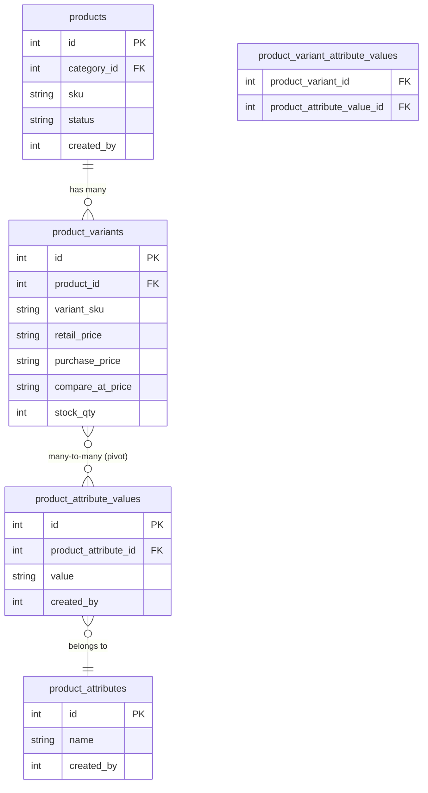
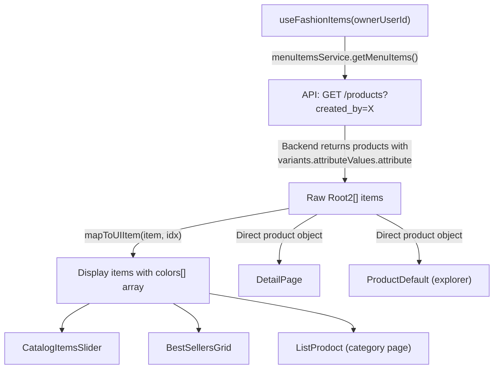

# Product Attribute Data Flow Analysis

## Overview

Complete analysis of how product **attribute data** flows from the Laravel backend database → API response → React frontend hooks → customer-facing UI components.

---

## 1. Database Schema (Backend)

### Tables & Relationships



### Key Models

| Model | File | Relationship |
|-------|------|-------------|
| `Product` | [Product.php](file:///d:/Laravel-Tutorial/laravel-api-VHsite/app/Models/Product.php) | `hasMany(ProductVariant)` |
| `ProductVariant` | [ProductVariant.php](file:///d:/Laravel-Tutorial/laravel-api-VHsite/app/Models/ProductVariant.php) | `belongsToMany(ProductAttributeValue)` via pivot `product_variant_attribute_values` |
| `ProductAttribute` | [ProductAttribute.php](file:///d:/Laravel-Tutorial/laravel-api-VHsite/app/Models/ProductAttribute.php) | `hasMany(ProductAttributeValue)` — e.g. name = "Color", "Size" |
| `ProductAttributeValue` | [ProductAttributeValue.php](file:///d:/Laravel-Tutorial/laravel-api-VHsite/app/Models/ProductAttributeValue.php) | `belongsTo(ProductAttribute)` — e.g. value = "Red", "#FF0000", "XL", "Cream\|#FFFDD0" |

---

## 2. API Response (Backend → Frontend)

### Eager Loading in Controller

The [ProductController.php](file:///d:/Laravel-Tutorial/laravel-api-VHsite/app/Http/Controllers/Api/v1/Owner/ProductController.php#L333) loads:

```php
Product::with(['translations', 'variants.attributeValues.attribute', 'images', 'brand'])
```

### JSON Response Shape per Product

```json
{
  "id": 1,
  "name": "Summer Dress",
  "price": "29.99",
  "variants": [
    {
      "id": 10,
      "variant_sku": "SD-RED-M",
      "retail_price": "29.9900",
      "stock_qty": 15,
      "attribute_values": [
        {
          "id": 5,
          "product_attribute_id": 1,
          "value": "Red",
          "attribute": {
            "id": 1,
            "name": "Color"
          }
        },
        {
          "id": 12,
          "product_attribute_id": 2,
          "value": "M",
          "attribute": {
            "id": 2,
            "name": "Size"
          }
        }
      ]
    }
  ]
}
```

> [!IMPORTANT]
> Each `attribute_value` object contains: `{ id, product_attribute_id, value, attribute: { id, name } }`.
> The **`value`** field can be: a hex color (`#FF0000`), a CSS color name (`red`), a pipe-delimited format (`Cream|#FFFDD0`), or a non-color value (`M`, `XL`).

---

## 3. Frontend TypeScript Interfaces

### [categories.ts](file:///d:/React.js/VHsite/src/api/categories.ts#L35-L49) — `ProductVariant`

```typescript
export interface ProductVariant {
  id?: number;
  variant_sku: string;
  retail_price: string;
  compare_at_price: string | null;
  stock_qty: number;
  attribute_values?: any[];  // ⚠️ Typed as any[]
  // ...
}
```

### [product.ts](file:///d:/React.js/VHsite/src/api/product.ts#L401-L417) — Attribute types (used for management, NOT on variant)

```typescript
export interface ProductAttributeValue {
  id: number;
  product_attribute_id: number;
  value: string;
}

export interface ProductAttribute {
  id: number;
  name: string;
  values?: ProductAttributeValue[];
}
```

> [!WARNING]
> `attribute_values` on `ProductVariant` is typed as `any[]` — no strict TypeScript enforcement. All downstream code accesses `av.value` directly.

---

## 4. Data Fetch Flow



### Hook: [useFashionItems.ts](file:///d:/React.js/VHsite/src/pages/owner_websitle/templetes/fashion_website/hooks/useFashionItems.ts)

1. Fetches products via `menuItemsService.getMenuItems(100, 0, ownerUserId)` (line 48)
2. Maps items via `mapToUIItem(item, idx)` for `displayItems` (line 65)
3. Returns: `displayItems`, `underTenItems`, `filteredItems`, `displayCatalogItems`

---

## 5. Attribute Processing in Each Component

### A. `mapToUIItem()` — [priceUtils.ts](file:///d:/React.js/VHsite/src/pages/owner_websitle/templetes/fashion_website/utils/priceUtils.ts)

**Used by:** `useFashionItems` → `CatalogItemsSlider`, `BestSellersGrid`

```typescript
// Extracts COLORS only (ignores sizes)
const colors: string[] = [];
item.variants.forEach(v => {
  v.attribute_values.forEach((av: any) => {
    if (
      av.value &&
      (av.value.startsWith('#') ||
        ['red', 'black', 'blue', 'green', 'purple', 'violet', 'indigo']
          .includes(av.value.toLowerCase()))
    ) {
      colors.push(av.value);
    }
  });
});
```

> [!CAUTION]
> **Issue 1 — Missing color names**: Only recognizes 7 CSS color names. Misses: `white`, `yellow`, `pink`, `gray`, `orange`, `brown` (which ARE recognized in `DetailPage` and `ListProdoct`).
>
> **Issue 2 — No pipe format support**: Does not parse `"Cream|#FFFDD0"` format. A value like this would be silently skipped.
>
> **Issue 3 — Duplicate colors**: No deduplication. If two variants have the same color, it appears twice.
>
> **Issue 4 — No sizes extracted**: This mapper only extracts colors. The `CatalogItemsSlider` and `BestSellersGrid` never get size data.

---

### B. `mapToUIItem()` — [ListProdoct.tsx](file:///d:/React.js/VHsite/src/pages/owner_websitle/templetes/fashion_website/components/ListProdoct.tsx#L119-L184) (duplicated version)

**Used by:** Category listing page

Extracts **both colors AND sizes** from `av.value`:

| Feature | Behavior |
|---------|----------|
| Colors | Checks 13 CSS names + hex `#` prefix |
| Sizes | Everything NOT a color |
| Pipe format | ❌ Not handled |
| Dedup | ❌ No deduplication |
| Fallback | Colors: pattern by `idx % 4`; Sizes: `['S', 'M', 'L']` |

---

### C. `DetailPage.tsx` — [parseAttributeValue()](file:///d:/React.js/VHsite/src/pages/owner_websitle/templetes/fashion_website/components/DetailPage.tsx#L50-L79)

**Used by:** Product detail modal/page — most robust implementation

```typescript
const parseAttributeValue = (val: string) => {
  if (val.includes('|')) {
    const [name, hex] = val.split('|');
    return { isColor: true, value: name, colorName: name, colorHex: hex };
  }
  const isColor = val.startsWith('#') || ['red','black','blue',...12 names].includes(val.toLowerCase());
  return { isColor, value: val, colorName: isColor ? val : '', colorHex: val.startsWith('#') ? val : '' };
};
```

| Feature | Behavior |
|---------|----------|
| Colors | ✅ 12 CSS names + hex `#` prefix |
| Pipe format | ✅ Parses `"Cream\|#FFFDD0"` → name + hex |
| Size detection | ✅ `!isColor` → size |
| Size availability check | ✅ `isSizeAvailable()` cross-references `selectedColor` |
| Gallery by color | ✅ Links variant images to their color attribute |
| Dedup | ✅ Uses `includes()` check |

---

### D. `ProductDefault.tsx` — [Explorer/Inspector](file:///d:/React.js/VHsite/src/pages/owner_websitle/templetes/fashion_website/components/helpers/ProductDefault.tsx#L409-L430)

**Used by:** Dev/owner schema explorer tool

Renders `attribute_values` as raw badges with a color dot if detected:

```tsx
const isColor = av.value && (av.value.startsWith('#') || 
  ['red','black',...13 names].includes(av.value.toLowerCase()));
```

- Shows all attribute values as raw text badges
- Adds a color swatch dot for recognized colors
- ❌ Does not parse pipe format

---

### E. `useCart.ts` — [Cart hook](file:///d:/React.js/VHsite/src/pages/owner_websitle/templetes/fashion_website/hooks/useCart.ts)

```typescript
addToCart(item: Root2, qtyToAdd = 1, size?: string, color?: string)
```

- Receives size/color as strings from `DetailPage`
- Creates cart ID as `"${item.id}-${size}-${color}"`
- ❌ Does NOT read `attribute_values` directly — relies on caller passing extracted values

---

## 6. Summary: Rendering Per Component

| Component | Source | Colors | Sizes | Pipe Format | Dedup |
|-----------|--------|--------|-------|-------------|-------|
| **CatalogItemsSlider** | `priceUtils.mapToUIItem` | ⚠️ 7 names + hex | ❌ | ❌ | ❌ |
| **BestSellersGrid** | `priceUtils.mapToUIItem` | ⚠️ 7 names + hex | ❌ | ❌ | ❌ |
| **ListProdoct** | local `mapToUIItem` | ✅ 13 names + hex | ✅ | ❌ | ❌ |
| **DetailPage** | `parseAttributeValue()` | ✅ 12 names + hex | ✅ | ✅ | ✅ |
| **ProductDefault** | inline render | ✅ 13 names + hex | Shows all | ❌ | N/A |
| **useCart** | Receives from caller | Passthrough | Passthrough | N/A | N/A |

---

## 7. Key Issues Found

### 🔴 Critical: Inconsistent Color Detection

[priceUtils.ts](file:///d:/React.js/VHsite/src/pages/owner_websitle/templetes/fashion_website/utils/priceUtils.ts#L23-L34) (used by homepage slider & best sellers) only recognizes **7** color names, while [DetailPage.tsx](file:///d:/React.js/VHsite/src/pages/owner_websitle/templetes/fashion_website/components/DetailPage.tsx#L56-L72) and [ListProdoct.tsx](file:///d:/React.js/VHsite/src/pages/owner_websitle/templetes/fashion_website/components/ListProdoct.tsx#L134-L139) recognize **12-13** names.

**Impact**: Products with colors like `white`, `yellow`, `pink`, `gray`, `orange`, `brown` will show NO color swatches on the homepage but WILL show them on the detail page.

### 🔴 Critical: Pipe Format Not Supported in Lists

Values like `"Cream|#FFFDD0"` are only parsed correctly in `DetailPage`. On all list views (`CatalogItemsSlider`, `BestSellersGrid`, `ListProdoct`), these values are silently skipped or treated as non-color sizes.

### 🟡 Medium: Duplicate Color Entries

Both `priceUtils.mapToUIItem` and `ListProdoct.mapToUIItem` push colors without dedup. If two variants share the same color, the UI renders duplicate color dots.

### 🟡 Medium: Code Duplication

`mapToUIItem` logic is **duplicated** in 3 places:
1. [priceUtils.ts](file:///d:/React.js/VHsite/src/pages/owner_websitle/templetes/fashion_website/utils/priceUtils.ts) (shared utility)
2. [ListProdoct.tsx](file:///d:/React.js/VHsite/src/pages/owner_websitle/templetes/fashion_website/components/ListProdoct.tsx#L119-L184) (local copy with different behavior)
3. Each uses slightly different color name lists and fallback logic

### 🟢 Low: `attribute_values` typed as `any[]`

The [ProductVariant interface](file:///d:/React.js/VHsite/src/api/categories.ts#L46) uses `any[]` for `attribute_values`, losing type safety across the entire frontend.

---

## 8. Recommended Fix

Unify all attribute parsing into one shared utility (extend [priceUtils.ts](file:///d:/React.js/VHsite/src/pages/owner_websitle/templetes/fashion_website/utils/priceUtils.ts)):

```typescript
// Unified parseAttributeValue function
export const parseAttributeValue = (val: string) => {
  if (!val) return { isColor: false, value: '', colorName: '', colorHex: '' };
  if (val.includes('|')) {
    const [name, hex] = val.split('|');
    return { isColor: true, value: name.trim(), colorName: name.trim(), colorHex: hex.trim() };
  }
  const COLOR_NAMES = ['red','black','blue','green','purple','violet','indigo',
    'white','yellow','pink','gray','orange','brown'];
  const isColor = val.startsWith('#') || COLOR_NAMES.includes(val.toLowerCase());
  return { isColor, value: val, colorName: isColor ? val : '', colorHex: val.startsWith('#') ? val : '' };
};

// Updated mapToUIItem with dedup + pipe support
export const mapToUIItem = (item: Root2, idx: number) => {
  // ... price/discount logic unchanged ...
  
  const colorsSet = new Set<string>();
  const sizesSet = new Set<string>();
  item.variants?.forEach(v => {
    v.attribute_values?.forEach((av: any) => {
      const parsed = parseAttributeValue(av.value);
      if (parsed.isColor) {
        colorsSet.add(parsed.colorHex || parsed.colorName);
      } else if (parsed.value) {
        sizesSet.add(parsed.value);
      }
    });
  });
  
  const colors = [...colorsSet];
  const sizes = [...sizesSet];
  // ... fallbacks ...
  return { ...item, colors, sizes, discount, compare_at_price };
};
```

Then remove the duplicate in `ListProdoct.tsx` and import from `priceUtils`.
